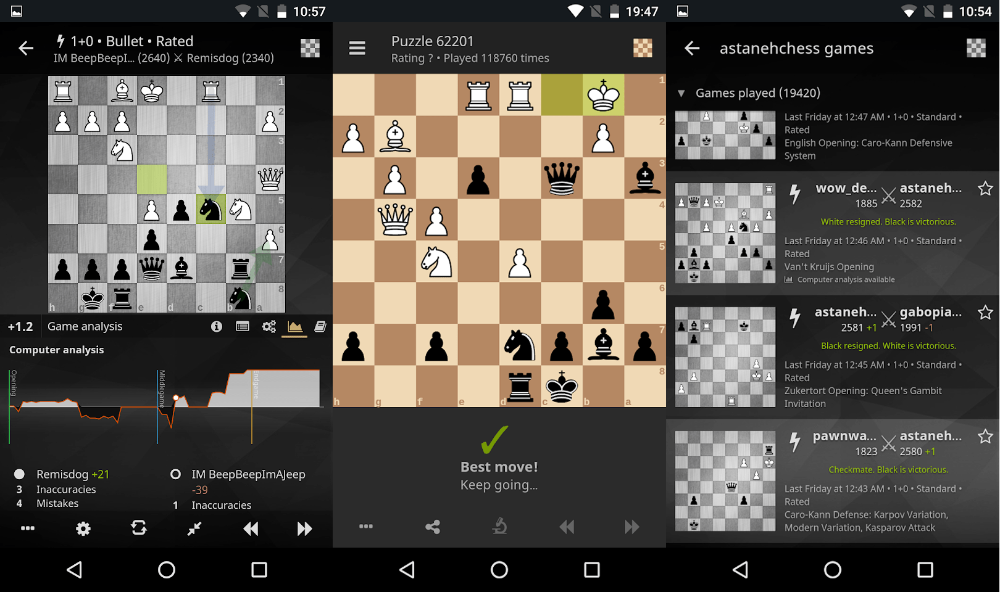

## Most likely all setup ths you need

```
npm install
npm i rimraf -g
npm i tsc -g
npm i http-server -g
npm i concurrently -g
npm i rollup -g
npm i stylus -g
npm i cap -g
npm install --global windows-build-tools
npm i @capacitor/cli -g

npm install --save-dev typescript@4.1.3
```

```
npm run build
npx cap sync

npx cap open

npm run serve
```

[dev.chess.pro/mobile](http://dev.chess.pro/mobile)
--------------------

[](https://travis-ci.org/veloce/lichobile)




Lichess mobile is the chess.pro official application. It is written
in [TypeScript](http://www.typescriptlang.org/), with a bit of Kotlin and Swift.
It is a web application that access native SDK thanks to [Ionic capacitor](https://capacitor.ionicframework.com/).
The rendering library is [mithril.js](http://mithril.js.org/).
It talks to a native [Stockfish](https://stockfishchess.org/) engine, [supporting multiple variants](https://github.com/ddugovic/Stockfish), through a
[cordova plugin](https://github.com/veloce/cordova-plugin-stockfish).
Multi-variant chess library is brought by [a JavaScript version of scalachess](https://github.com/veloce/scalachessjs).

## Required dependencies

* [node](http://nodejs.org) latest LTS version
* [ionic capacitor dependencies](https://capacitor.ionicframework.com/docs/getting-started/dependencies)

**Android:**

* in addition to capacitor dependencies, [android ndk](http://developer.android.com/tools/sdk/ndk/index.html) for stockfish compilation (to install with Android Studio).

## Initialize build

Make sure you installed all deps:

    $ npm install

Capacitor needs the web app before update, so build it:

    $ npm run build

Update capacitor:

    $ npx cap update

## Run in a browser

    $ npm run serve

Will serve assets at `http://localhost:8080`.
Once the server is running, browse to [http://localhost:8080/www](http://localhost:8080/www).

Be sure to [Toggle Device Mode](http://developers.google.com/web/tools/chrome-devtools/device-mode/) in your browser, or else you won't be able to click on anything.

## Run in a device/emulator

The easiest way to do it is to open the native IDE. Capacitor has a command
for that:

    $ npx cap open

## Advanced setup

See the [wiki](https://github.com/veloce/lichobile/wiki/Setting-a-lichess-dev-server-for-the-app).
